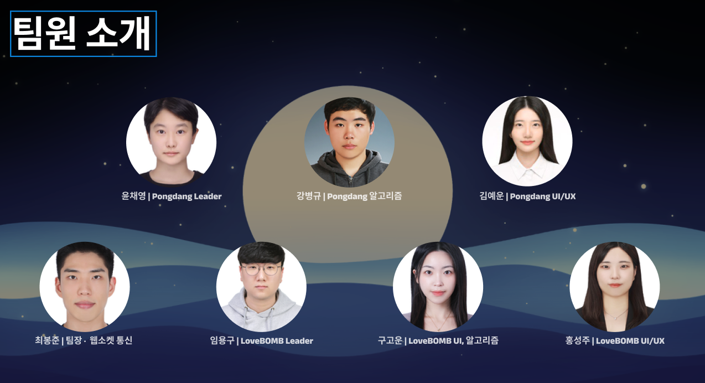

# 웹소켓 통신을 이용한 실시간 게임

# 목차

1. [기획 배경](#기획-배경)
2. [팀원 소개](#팀원-소개)
3. [서비스 소개](#서비스-소개)
4. [기술 스택](#기술-스택)
5. [주요 알고리즘](#주요-알고리즘)

# 기획 배경

## 목적

- 알고리즘 학습 기간에 더 효율적인 학습 방법을 찾고자 실무적으로 활용 가능한 프로젝트를 진행.
- 특히 Python의 문법 구조, 객체 지향 프로그래밍(class) 등을 실제 프로젝트에서 접목하여 이해를 높임.

# 팀원 소개

# 서비스 소개

- 이 프로젝트는 SSAFY 내 반 친구들을 대상으로 진행한 'SSAFY데이' 이벤트를 위해 개발된 실시간 PvP 게임 서비스입니다. 총 3가지 게임 모드로 구성되어 있으며, 각각의 게임을 통해 이벤트 승자를 가리는 것을 목표로 했습니다.

- 제공게임
  - 네코팡(애니팡): 같은 모양의 블록을 터뜨리는 퍼즐 게임
  - 퐁당(알까기): 상대의 공을 밀어내는 전략 게임
  - 러브밤(포트리스): 포탄을 쏘아 상대를 공격하는 슈팅 게임
  - 폴더 안 리드미 확인 가능
    
## 기술 스택

### Pygame

- 

### WebSocket

### 주요 알고리즘

