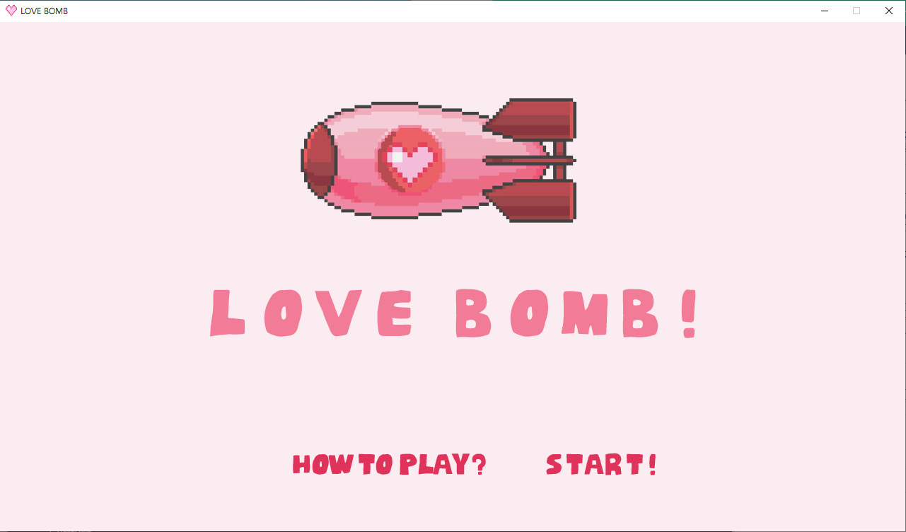
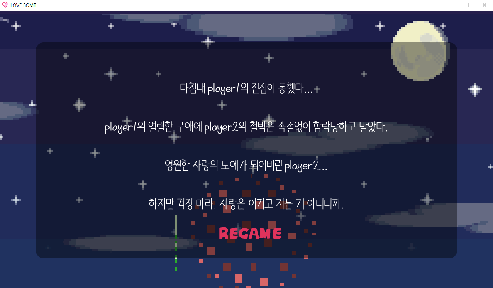
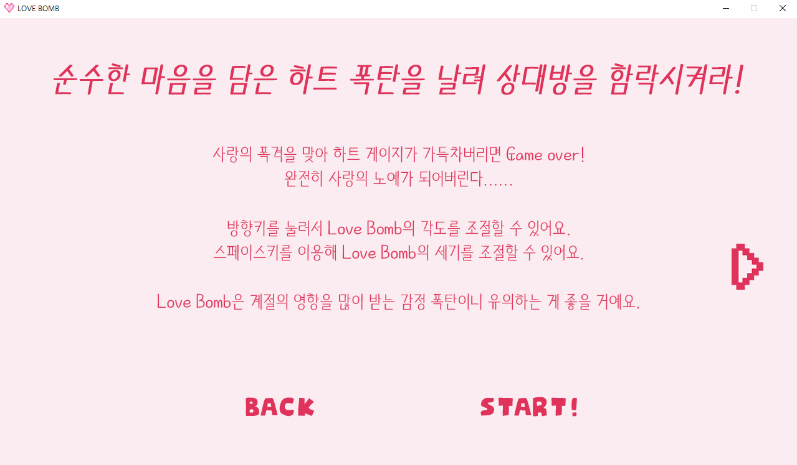
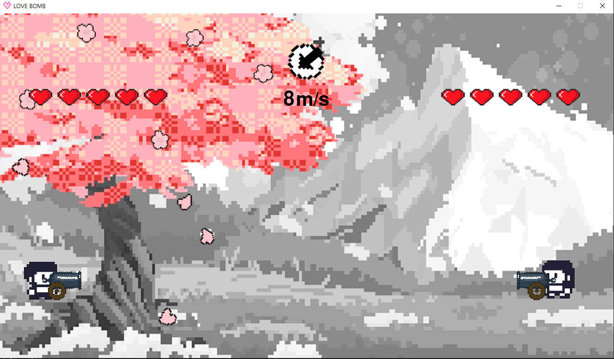
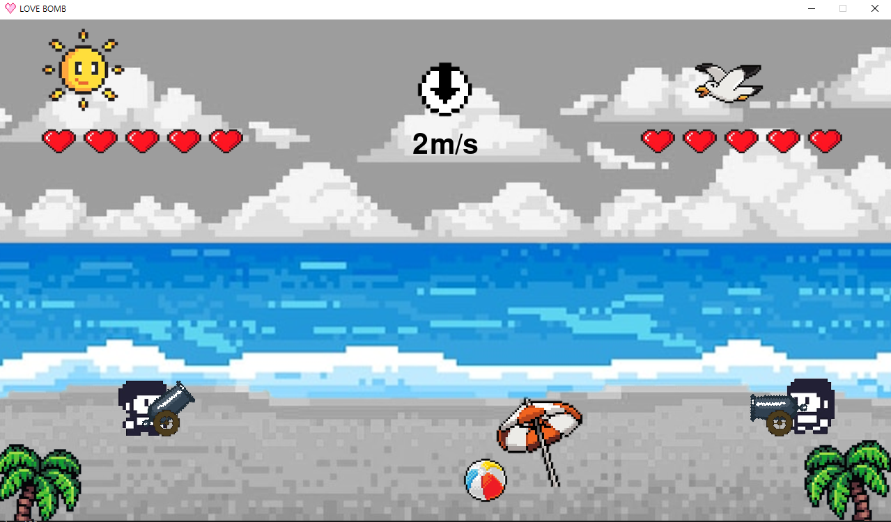
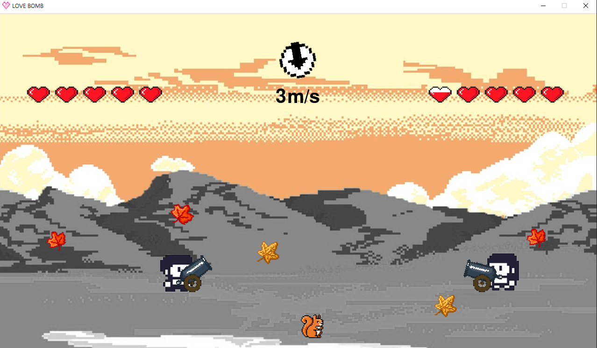
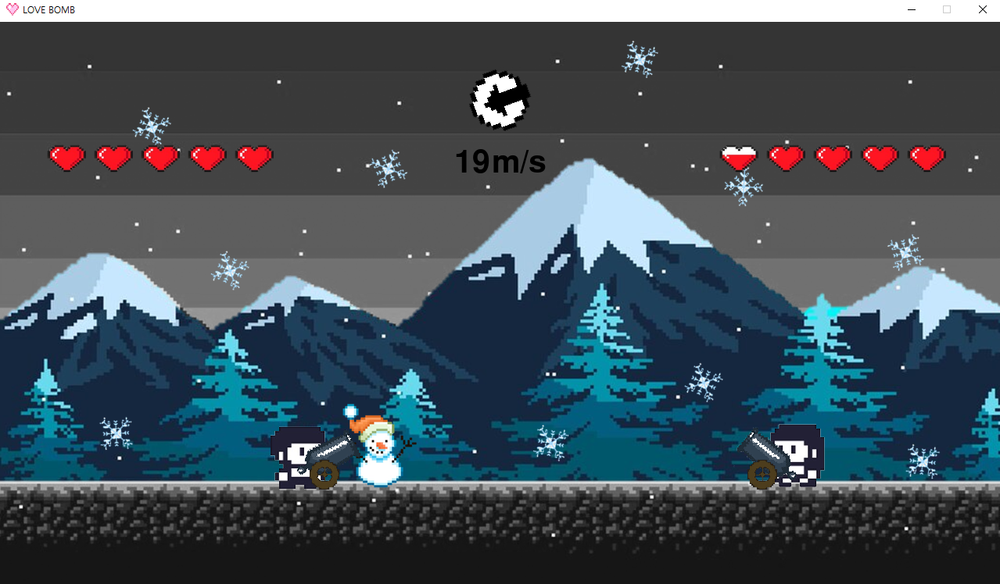
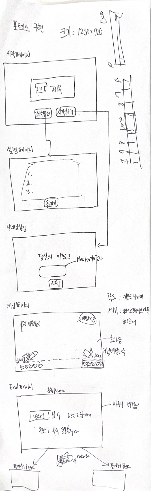

# 💞LOVE BOMB(포트리스) : 임용구, 구고운, 홍성주

## 🎮 게임 설명

포트리스 기반의 고백 공략 게임!💖 
순수한 마음을 담은 LOVE BOMB을 날려 상대방을 함락시켜라! 
사랑의 폭격을 맞아 하트 게이지가 가득차버리면 Game over! 
완전히 사랑의 노예가 되어버린다...... 
하지만 걱정하지 마라. 사랑은 이기고 지는 GAME이 아니니까 ヾ(•ω•`)o...
 
 
 
 

### 💟 MAIN & ENDING

| 시작 화면                       | 엔딩 화면                    |
| ------------------------------- | ------------------------------ | 
|  |  |

### ✔ How To Play?

| 설명 화면1                      | 설명 화면2                    |
| ------------------------------- | ------------------------------ | 
|  |  |

### 🏝 계절 구현

| 봄                              | 여름                            |
| ------------------------------- | ------------------------------ | 
|  |  |

| 가을                              | 겨울                            |
| ------------------------------- | ------------------------------ | 
|  |  |
 

### 🎲 조작법

 - 상하 방향키로 대포 각도 조절
 - 좌우 방향키로 유저 위치 조절
 - 스페이스바를 이용해 포탄 파워 조절
 
 
 

## 👨‍👧‍👧 회의 스크립트
### 2024.04.04
### 1. 역할 분담
- 임용구 &nbsp;:  &nbsp;총괄, 주요 코드 구현 (포탄 각도, 발사, 힘)
- 홍성주 &nbsp;: &nbsp;UI 코드 구현, 디자인, 음악 삽입, 엔딩 동적 이미지 구현
- 구고운 &nbsp;:  &nbsp;UI 코드 구현, 디자인, 스토리 제작, hp 코드 구현

### 2. 해야할 것
- 화면 크기 1000x700 (예정)
- 디자인적 요소: 배경(봄, 여름, 가을, 겨울), 게이지 하트, 캐릭터, 하트화살
- BGM: 게임 배경음악, 맞을때 효과음, 던질때 효과음

### 3. UI 함수 구현하기 [고운, 성주]
- 시작 화면 함수 구현(시작하기 누르면 게임 연결) => 완료
- 맞으면 하트 게이지 -1 함수 구현 (하트 5개, 우선 특정 위치 클릭하면 하트 개수 -1 되도록 구현) (예정)
- 마지막 결과 함수 구현 (하트가 하나도 없거나, 턴 횟수 다 돌면 결과 화면 출력, 이긴 플레이어 숫자를 꺼내서 우승자에게 화면 출력) (예정)
---

## 2024.04.09
### 1. 게임 가이드라인 제작

### 2. 게임 아이디어 재조정
- 계절별로 배경 존재
- 계절별로 정해진 풍향과 풍속이 있음
- 이를 게임 시작 전 설명서로 설명해서 플레이 중에는 신경 쓰지 않도록 함
- 계절 배경에 따라 풍향과 풍속 옵션이 다르게 반영될 뿐 가시적으로 드러나지는 않음

### 3. 배경 크기 픽스
- 1280x720
---

## 2024.04.16
### 1. 스크립트 제작 [고운]
- 게임 설명
순수한 마음을 담은 하트 폭탄을 날려 상대방을 함락시켜라!
사랑의 폭격을 맞아 하트 게이지가 가득차버리면 Game over!
완전히 사랑의 노예가 되어버린다......

방향키를 눌러서 Love Bomb의 각도를 조절할 수 있어요.
스페이스키를 이용해 Love Bomb의 세기를 조절할 수 있어요.

Love Bomb은 계절의 영향을 많이 받는 감정 폭탄이니 유의하는 게 좋을 거예요.

- 계절 설명
<계절>
사랑의 계절, 봄 - {{기본 셋팅}} 날씨의 영향을 타지 않아요. 순수한 사랑을 전할 수 있어요.
스치기만 해도 불쾌한, 여름 - {{바람 x, 폭탄 랜덤 소멸}} 불쾌지수 10000%! 전하고 싶던 사랑 마저도 가끔은 녹아버린다는 소문이...
산책하기 좋은, 가을 - 선선한 바람이 가슴을 간지럽혀요. 폭탄에는 힘이 실리고 파괴력은 더블 업! 사랑에 쉽게 빠지는 계절이에요.
마음까지 움츠러드는, 겨울 - {{바람 저항 O, 폭탄 파괴력은 변화 X}} 한 겹 롱패딩을 뚫고 나온 사랑 폭탄의 힘이 약해져요. 평소처럼 날린다면 상대방에게 닿지 못한 마음이 될 수 있어요. 하지만, 추위마저도 이겨낸 강력한 사랑이 마침내 닿았을 때 순수한 파괴력을 가져요.
(=> 디자인 컨셉: 연애편지)

- 엔딩
(모든 경우는 <승자 - player1 // 패자 - player2> 상정)

[ 승패가 갈린 경우 ]

마침내{{ player1.playername }}의 진심이 통했다......
{{ player1.playername }}의 열렬한 구애에 {{ player2.playername }}의 철벽은 속절없이 함락당하고 말았다. 영원한 사랑의 노예가 되어버린 {{ player2.playername }}...
하지만 걱정 마라. 사랑은 이기고 지는 게 아니니까.

사랑의 주인 {{ player1.playername }}
사랑의 노예 {{ player2.playername }}

[ 비긴 경우 ] 
 턴제로 페어 플레이하기 때문에
 -1. 둘 다 동일한 턴에 하트 게이지를 다 채운 case -> 먼저 채운 쪽이 승
 -2. 둘 다 마지막 턴이 끝날 때까지 하트 게이지를 못 채운 case -> 진짜 비김

{{ player1.playername }}과 {{ player2.playername }}의 진심에는 한끗이 부족하다.
서로는 서로를 갈망했으나, 그 누구의 마음도 얻지 못했다.
이번 사랑은 저물어가지만, 괜찮다!
{{ player1.playername }}, {{ player2.playername }}는 값진 깨달음을 얻었으니까.
바로...... 사랑의 키포인트는 적극적인 애정 공세라는 사실!

### 2. 메인페이지 제작 [성주]

---

## 2024.04.16
### 1. 게임 동작 구현 완료(용구)
- 전역 변수 turn에 따라 계절이 바뀌고, 계절에 따라 저항 값이 결정되고, 풍속과 풍향이 무작위로 결정되도록 하였다.
- 게임 구현에서는 앞 뒤 방향키를 통해 대포의 위치를 결정하고, 위 아래 방향키를 통해 대포의 발사각을 결정하고, space 키를 통해 발사 속도를 결정하였다.
- 포물선의 움직임을 구하는 방정식과 대포의 발사각과 발사 속도를 통해 y값이 0이 되는 t_end를 구하고, 0 ~ t_end 까지 0.1 간격으로 나누어 t_list를 구하였다.
- t_list를 순회하며 t에 따른 x와 y의 좌표를 구해 각각 x_list와 y_list에 삽입하였다.
- space에서 손을 떼면 shot 함수가 호출되고, shot 함수는 각 x_list와 y_list를 순회하며 포탄을 출력하게 된다.
- 이 때 포탄이 지나가면 이전 포탄을 없애야 하므로 배경 -> 대포 -> 포탄 순으로 이미지를 새로 출력하여 갱신하였다.

## 2024.04.17
### 메인 이미지와 게임 연결 및 플레이어 설정 완료 (용구)
- 메인 화면을 출력하는 함수와 게임을 실행하는 함수를 연결하였다.
- 메인 화면에서 게임을 시작하면 준비 화면으로 넘어가고, 준비 화면에서 플레이어 1, 2가 준비가 되면 게임을 시작
- Player 클래스를 이용하여 플레이어1과 플레이어2를 생성
- 각 턴에 따라 움직일 플레이어를 선정하고, 게임을 실행한다.
- 각 플레이어의 위치와 현재 상황에 따라 대포의 위치와 형태가 변하도록 설정하였다.

## 2024.04.22
### 플레이어 체력 표시, 대포 발사 시 시작 위치 및 낙하 위치 조정 (용구)
- 플레이어의 체력에 따라 각각 다른 이미지가 출력되도록 변경
- 체력을 5개 구간으로 나누고, (hp-1)//20의 값의 초과는 최대 체력이고, 미만은 최소 체력으로 판별
- (hp-1)//20인 구간은 체력을 얼마나 표시해야하는지 판별되지 않았으므로, hp % 20을 통해 구간별로 다시 나누고 체력 이미지 교체
- 삼각함수 공식과 대포 이미지의 픽셀을 계산하여 대포 발사시 포탄 출력이 시작되야 하는 위치를 대강 계산
- 이에 따른 좌표를 구하는 공식도 소폭 수정
