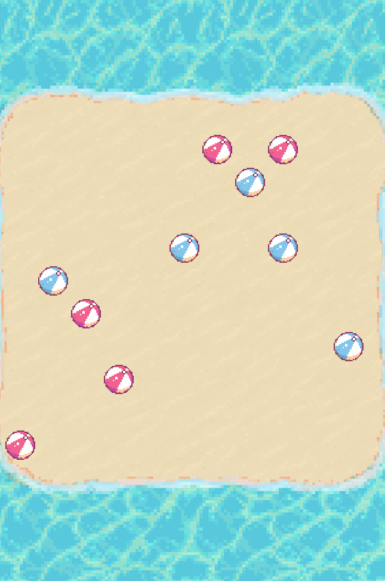

# 퐁당 PONGDANG - 사이드 프로젝트

## 🚩 목차

- 개요
- 게임 플레이 설명
- 게임 구조
- 역할 분담

## 📑 개요

- 프로젝트 이름: PONGDANG
- 프로젝트 진행 기간: 2024.03 - 2024.04
- 개발 언어: Python
- 팀원: 강병규, 김예운, 윤채영

## 🎮 게임 설명

| 시작 화면                       | 플레이 화면                    | 엔딩 화면                      |
| ------------------------------- | ------------------------------ | ------------------------------ |
|  |  |  |

- 상대의 비치볼을 밀어내라! 육지 위에 마지막까지 살아남는 플레이어가 승자가 되는 전략 알 까기 게임

### GAME TIP!

- 돌을 하나씩 조작해 상대의 돌을 밀어내는 기존 알 까기 게임과 달리, 플레이어는 플레이 턴에 자신의 비치볼 다섯 개를 한꺼번에 조작한다. 이때에 상대 플레이어 역시 비치볼을 조작한다. 턴이 끝나면 해당 비치볼들은 동시에 조작한 위치로 나아가며 충돌한다. 즉 플레이어는 상대의 돌을 밀어내는 공격적인 전략을 취할 것인지, 피하는 방어적인 전략을 취할 것인지 선택해야 한다. 60%의 운과 40%의 전략이 게임을 좌우하는 게임!

### 플레이 룰

1. 플레이어별 다섯 개의 비치볼이 보드 위 랜덤한 위치에 주어진다.
2. 플레이어는 각 비치볼들의 방향, 파워를 조작한다.
3. 플레이 턴이 끝나면, 각 플레이어의 볼들이 동시에 조작한 위치로 나아가며 서로 충돌한다.
4. 2-3번을 반복하며, 상대의 비치볼을 밀어내고 보드 위에 끝까지 비치볼이 남은 플레이어가 승리하게 된다.

## ⚙ 게임 구조

### 기본 구조

1. 디스플레이 사이즈

- width: 650 px
- heigt: 977 px

2. 게임 화면 구성

- 소켓 대기 화면
- 스타트 화면
- 메인(플레이) 화면
- 엔딩 화면

### 게임 로직

- 소켓 대기
- 스타트
- 메인
- 엔딩

## 👨‍👧‍👧 역할 분담

### 총괄 - 윤채영

- 화면 합치기
- 게임 디버깅
- 소켓통신 서브

### 디자인 팀장 - 김예운

- 디자인 아이디어(해변)
- 이미지 및 사운드

### 백엔드 팀장 - 강병규

- 게임 메인 로직 담당
